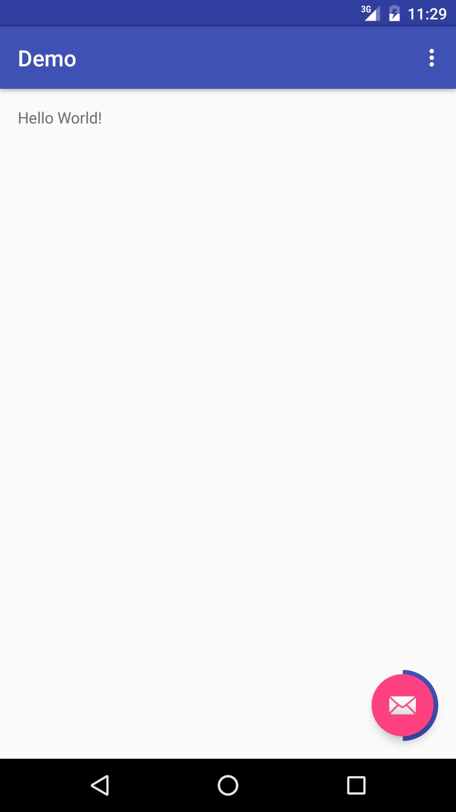

# ProgressFloatingActionButton 

[](https://android-arsenal.com/details/1/3075) [  ](https://bintray.com/dmallcott/maven/ProgressFloatingActionButton/_latestVersion)

This is an extension of the Floating Action Button that allows the user to monitor his progress on a given task. For example, if you have segmented form and use the FAB to validate and move to the next segment of the form. 

If you want to suggest changes, new functionalities or just give me tips for better programming I would greatly appreciate it.

<p align="center">
    
</p>

## Installation

```
compile 'com.dmallcott:progressfab:1.0.0'
```

## How to use

Using the pFab is as simple as using a regular FloatingActionButton. Just add this to your layout file and you're good to go:

```xml
<com.dmallcott.progressfloatingactionbutton.ProgressFloatingActionButton
        android:id="@+id/fab"
        android:layout_width="wrap_content"
        android:layout_height="wrap_content"
        android:layout_gravity="bottom|end"
        app:pFabProgressIcon="@android:drawable/ic_dialog_email"
        app:pFabFinalIcon="@android:drawable/ic_dialog_dialer"
        app:pFabStartingProgress="0"
        app:pFabStepSize="50"
        app:pFabTotalProgress="100"/>
```

## TO-DO

Since I've only worked on this for a couple of hours there's still a lot of things to do. I will keep track of them here as a way of showing what the future holds for the library.

<ol>
<li>Add support to coordinator layout with behaviour.</li>
<li>Unit testing</li>
<li>Add support to pre-honeycomb animations</li>
<li>Better demo app</li>
<li>Animate Fab icon change</li>
</ol>

## License

Copyright (C) 2016 Daniel Mallcott

Licensed under the Apache License, Version 2.0 (the "License");
you may not use this file except in compliance with the License.
You may obtain a copy of the License at
 
    http://www.apache.org/licenses/LICENSE-2.0
 
Unless required by applicable law or agreed to in writing, software
distributed under the License is distributed on an "AS IS" BASIS,
WITHOUT WARRANTIES OR CONDITIONS OF ANY KIND, either express or implied.
See the License for the specific language governing permissions and
limitations under the License.
 
